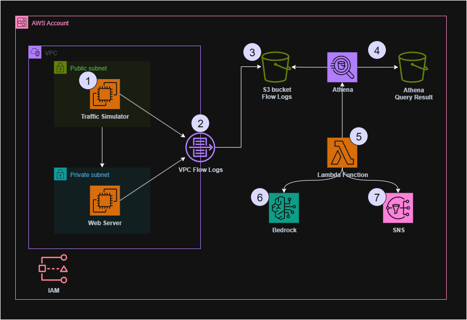

# VPC Log Análisis IA

Infraestructura Terraform para detectar tráfico anómalo en VPC Flow Logs utilizando Inteligencia Artificial con Amazon Bedrock.



## 📋 Descripción

Este proyecto implementa una solución completa para el análisis inteligente de VPC Flow Logs en AWS. La infraestructura captura automáticamente el tráfico de red, almacena los logs en S3, los analiza con Athena y utiliza Amazon Bedrock (IA Generativa) para detectar anomalías y generar alertas inteligibles.

### Características principales

- **Captura automática**: VPC Flow Logs configurados para capturar todo el tráfico de red
- **Almacenamiento optimizado**: Particionado por fecha en Amazon S3 para consultas eficientes
- **Análisis SQL**: Queries programadas en Amazon Athena para detectar patrones anómalos
- **IA Generativa**: Amazon Bedrock interpreta los datos y genera explicaciones claras
- **Alertas inteligentes**: Sistema de notificaciones con SNS integrado
- **Automatización**: EventBridge para ejecuciones programadas

## 🏗️ Arquitectura

La solución incluye tres entornos principales:

1. **VPC de Aplicación**: Instancias EC2 que generan tráfico normal
2. **VPC de Simulación**: Entorno controlado para pruebas
3. **Attack Box**: Simulador de tráfico anómalo para testing

### Flujo de datos

```
VPC Traffic → Flow Logs → S3 → Athena → Lambda → Bedrock → SNS → Alertas
```

El diagrama completo de la arquitectura se encuentra en la carpeta `images/`.

## 🚀 Inicio Rápido

### Prerrequisitos

- Terraform >= 1.0
- AWS CLI configurado
- Permisos IAM para crear recursos VPC, S3, Athena, Lambda, Bedrock y SNS
- Par de claves EC2 existente

### Instalación

1. Clona el repositorio:
```bash
git clone https://github.com/gterryc/vpc-log-analisis-ia.git
cd vpc-log-analisis-ia
```

2. Inicializa Terraform:
```bash
terraform init
```

3. Copia el archivo de variables de ejemplo:
```bash
cp terraform.tfvars.example terraform.tfvars
```

4. Edita las variables según tu entorno:
```bash
# Ejemplo de configuración mínima
aws_region = "us-east-1"
key_pair_name = "my-keypair"
bucket_name = "mi-empresa-vpc-flowlogs-2024"
environment = "dev"
```

5. Aplica la infraestructura:
```bash
terraform plan
terraform apply
```

## ⚙️ Configuración

### Variables principales

| Variable | Descripción | Tipo | Valor por defecto |
|----------|-------------|------|-------------------|
| `aws_region` | Región de AWS | `string` | `"us-east-1"` |
| `bedrock_model_id` | Modelo de Bedrock para IA | `string` | `"anthropic.claude-3-5-sonnet-20240620-v1:0"` |
| `bucket_name` | Nombre del bucket S3 | `string` | **Requerido** |
| `environment` | Entorno de despliegue | `string` | **Requerido** |
| `key_pair_name` | Par de claves EC2 | `string` | **Requerido** |

### Configuración avanzada

```hcl
# Personalización de VPC
vpc_cidr = "10.0.0.0/16"
public_subnet_cidr = "10.0.1.0/24"
private_subnet_cidr = "10.0.2.0/24"

# Configuración de Lambda
lambda_name = "anomaly-detection-function"
instance_type = "t3.micro"
```

## 🔍 Uso

### Monitoreo de anomalías

Una vez desplegada la infraestructura:

1. **Los VPC Flow Logs se capturan automáticamente** y se almacenan en S3
2. **Lambda ejecuta análisis periódicos** utilizando queries predefinidas en Athena
3. **Bedrock analiza los resultados** y genera explicaciones en lenguaje natural
4. **SNS envía alertas** cuando se detectan anomalías

### Consultas personalizadas

Puedes ejecutar tus propias consultas en Athena:

```sql
SELECT sourceaddr, destaddr, destport, action, COUNT(*) as count
FROM vpc_flow_logs
WHERE action = 'REJECT'
GROUP BY sourceaddr, destaddr, destport, action
ORDER BY count DESC
LIMIT 10;
```

### Logs y monitoreo

- **CloudWatch Logs**: Logs de Lambda y ejecuciones
- **CloudWatch Metrics**: Métricas de rendimiento del sistema
- **SNS Topics**: Configurables para Slack, email o otros servicios

## 📊 Ejemplos de detección

El sistema puede detectar automáticamente:

- Escaneo de puertos
- Intentos de conexión a servicios no autorizados
- Tráfico desde IPs sospechosas
- Patrones de tráfico anómalos
- Intentos de exfiltración de datos

## 🛠️ Desarrollo

### Estructura del proyecto

```
.
├── main.tf                 # Configuración principal
├── variables.tf            # Definición de variables
├── outputs.tf             # Outputs del módulo
├── versions.tf            # Versiones de providers
├── images/                # Diagramas y documentación visual
│   └── architecture-diagram.png
├── examples/              # Ejemplos de uso
└── docs/                  # Documentación adicional
```

### Contribuir

1. Fork el repositorio
2. Crea una rama para tu feature (`git checkout -b feature/AmazingFeature`)
3. Commit tus cambios (`git commit -m 'Add some AmazingFeature'`)
4. Push a la rama (`git push origin feature/AmazingFeature`)
5. Abre un Pull Request

## 🔒 Seguridad

- Todos los buckets S3 incluyen cifrado
- Roles IAM con permisos mínimos necesarios
- VPC con subnets públicas y privadas
- Security Groups restrictivos por defecto

## 📚 Documentación

- [AWS VPC Flow Logs](https://docs.aws.amazon.com/vpc/latest/userguide/flow-logs.html)
- [Amazon Athena](https://docs.aws.amazon.com/athena/)
- [Amazon Bedrock](https://docs.aws.amazon.com/bedrock/)
- [Terraform AWS Provider](https://registry.terraform.io/providers/hashicorp/aws/latest/docs)

## 🆘 Soporte

Si encuentras algún problema o tienes preguntas:

1. Busca en los [Issues existentes](https://github.com/gterryc/vpc-log-analisis-ia/issues)
2. Crea un nuevo Issue si es necesario
3. Mándame un email a gterryc@gmail.com

## 📄 Licencia

Este proyecto está bajo la Licencia MIT. Ver el archivo `LICENSE` para más detalles.

---

## Terraform Documentation

<!-- BEGIN_TF_DOCS -->
#### Requirements

| Name | Version |
|------|---------|
| <a name="requirement_terraform"></a> [terraform](#requirement_terraform) | >= 1.10.0 |
| <a name="requirement_archive"></a> [archive](#requirement_archive) | 2.7.1 |
| <a name="requirement_aws"></a> [aws](#requirement_aws) | >=5.0.0 |
| <a name="requirement_random"></a> [random](#requirement_random) | ~> 3.1 |

#### Providers

| Name | Version |
|------|---------|
| <a name="provider_archive"></a> [archive](#provider_archive) | 2.7.1 |
| <a name="provider_aws"></a> [aws](#provider_aws) | 6.8.0 |
| <a name="provider_random"></a> [random](#provider_random) | 3.7.2 |

#### Resources

| Name | Type |
|------|------|
| [aws_athena_named_query.data_exfiltration_detection](https://registry.terraform.io/providers/hashicorp/aws/latest/docs/resources/athena_named_query) | resource |
| [aws_athena_named_query.ddos_detection](https://registry.terraform.io/providers/hashicorp/aws/latest/docs/resources/athena_named_query) | resource |
| [aws_athena_named_query.port_scanning_detection](https://registry.terraform.io/providers/hashicorp/aws/latest/docs/resources/athena_named_query) | resource |
| [aws_athena_named_query.unusual_protocol_detection](https://registry.terraform.io/providers/hashicorp/aws/latest/docs/resources/athena_named_query) | resource |
| [aws_athena_workgroup.anomaly_detection](https://registry.terraform.io/providers/hashicorp/aws/latest/docs/resources/athena_workgroup) | resource |
| [aws_cloudwatch_log_group.lambda_logs](https://registry.terraform.io/providers/hashicorp/aws/latest/docs/resources/cloudwatch_log_group) | resource |
| [aws_eip.attack_simulator](https://registry.terraform.io/providers/hashicorp/aws/latest/docs/resources/eip) | resource |
| [aws_eip.nat](https://registry.terraform.io/providers/hashicorp/aws/latest/docs/resources/eip) | resource |
| [aws_flow_log.main](https://registry.terraform.io/providers/hashicorp/aws/latest/docs/resources/flow_log) | resource |
| [aws_glue_catalog_database.vpc_flow_logs](https://registry.terraform.io/providers/hashicorp/aws/latest/docs/resources/glue_catalog_database) | resource |
| [aws_glue_catalog_table.vpc_flow_logs](https://registry.terraform.io/providers/hashicorp/aws/latest/docs/resources/glue_catalog_table) | resource |
| [aws_iam_instance_profile.ec2_profile](https://registry.terraform.io/providers/hashicorp/aws/latest/docs/resources/iam_instance_profile) | resource |
| [aws_iam_role.ec2_role](https://registry.terraform.io/providers/hashicorp/aws/latest/docs/resources/iam_role) | resource |
| [aws_iam_role.lambda_role](https://registry.terraform.io/providers/hashicorp/aws/latest/docs/resources/iam_role) | resource |
| [aws_iam_role_policy.cw_logs_inline](https://registry.terraform.io/providers/hashicorp/aws/latest/docs/resources/iam_role_policy) | resource |
| [aws_iam_role_policy_attachment.athena_lambda](https://registry.terraform.io/providers/hashicorp/aws/latest/docs/resources/iam_role_policy_attachment) | resource |
| [aws_iam_role_policy_attachment.bedrock_ec2](https://registry.terraform.io/providers/hashicorp/aws/latest/docs/resources/iam_role_policy_attachment) | resource |
| [aws_iam_role_policy_attachment.bedrock_lambda](https://registry.terraform.io/providers/hashicorp/aws/latest/docs/resources/iam_role_policy_attachment) | resource |
| [aws_iam_role_policy_attachment.glue_lambda](https://registry.terraform.io/providers/hashicorp/aws/latest/docs/resources/iam_role_policy_attachment) | resource |
| [aws_iam_role_policy_attachment.s3_lambda](https://registry.terraform.io/providers/hashicorp/aws/latest/docs/resources/iam_role_policy_attachment) | resource |
| [aws_iam_role_policy_attachment.sns_ec2](https://registry.terraform.io/providers/hashicorp/aws/latest/docs/resources/iam_role_policy_attachment) | resource |
| [aws_iam_role_policy_attachment.sns_lambda](https://registry.terraform.io/providers/hashicorp/aws/latest/docs/resources/iam_role_policy_attachment) | resource |
| [aws_iam_role_policy_attachment.ssm_ec2](https://registry.terraform.io/providers/hashicorp/aws/latest/docs/resources/iam_role_policy_attachment) | resource |
| [aws_instance.attack_simulator](https://registry.terraform.io/providers/hashicorp/aws/latest/docs/resources/instance) | resource |
| [aws_instance.web_server](https://registry.terraform.io/providers/hashicorp/aws/latest/docs/resources/instance) | resource |
| [aws_internet_gateway.main](https://registry.terraform.io/providers/hashicorp/aws/latest/docs/resources/internet_gateway) | resource |
| [aws_lambda_function.anomaly_detection_processor](https://registry.terraform.io/providers/hashicorp/aws/latest/docs/resources/lambda_function) | resource |
| [aws_nat_gateway.main](https://registry.terraform.io/providers/hashicorp/aws/latest/docs/resources/nat_gateway) | resource |
| [aws_route_table.private](https://registry.terraform.io/providers/hashicorp/aws/latest/docs/resources/route_table) | resource |
| [aws_route_table.public](https://registry.terraform.io/providers/hashicorp/aws/latest/docs/resources/route_table) | resource |
| [aws_route_table_association.private](https://registry.terraform.io/providers/hashicorp/aws/latest/docs/resources/route_table_association) | resource |
| [aws_route_table_association.public](https://registry.terraform.io/providers/hashicorp/aws/latest/docs/resources/route_table_association) | resource |
| [aws_security_group.attack_simulator](https://registry.terraform.io/providers/hashicorp/aws/latest/docs/resources/security_group) | resource |
| [aws_security_group.web_server](https://registry.terraform.io/providers/hashicorp/aws/latest/docs/resources/security_group) | resource |
| [aws_sns_topic.anomaly_alerts](https://registry.terraform.io/providers/hashicorp/aws/latest/docs/resources/sns_topic) | resource |
| [aws_sns_topic_policy.anomaly_alerts_policy](https://registry.terraform.io/providers/hashicorp/aws/latest/docs/resources/sns_topic_policy) | resource |
| [aws_sns_topic_subscription.email_alerts](https://registry.terraform.io/providers/hashicorp/aws/latest/docs/resources/sns_topic_subscription) | resource |
| [aws_subnet.private](https://registry.terraform.io/providers/hashicorp/aws/latest/docs/resources/subnet) | resource |
| [aws_subnet.public](https://registry.terraform.io/providers/hashicorp/aws/latest/docs/resources/subnet) | resource |
| [aws_vpc.main](https://registry.terraform.io/providers/hashicorp/aws/latest/docs/resources/vpc) | resource |
| [aws_vpc_endpoint.s3_gateway](https://registry.terraform.io/providers/hashicorp/aws/latest/docs/resources/vpc_endpoint) | resource |
| [random_string.suffix](https://registry.terraform.io/providers/hashicorp/random/latest/docs/resources/string) | resource |

#### Inputs

| Name | Description | Type | Default | Required |
|------|-------------|------|---------|:--------:|
| <a name="input_aws_region"></a> [aws_region](#input_aws_region) | AWS region para desplegar recursos | `string` | `"us-east-1"` | no |
| <a name="input_bedrock_model_id"></a> [bedrock_model_id](#input_bedrock_model_id) | ID del modelo de Bedrock | `string` | `"anthropic.claude-3-5-sonnet-20240620-v1:0"` | no |
| <a name="input_bucket_name"></a> [bucket_name](#input_bucket_name) | S3 Bucket Name | `string` | n/a | yes |
| <a name="input_email"></a> [email](#input_email) | Email principal para recibir alertas | `string` | n/a | yes |
| <a name="input_instance_type"></a> [instance_type](#input_instance_type) | Tipo de instancia EC2 | `string` | `"t3.micro"` | no |
| <a name="input_key_pair_name"></a> [key_pair_name](#input_key_pair_name) | Nombre del key pair para instancias EC2 | `string` | n/a | yes |
| <a name="input_lambda_name"></a> [lambda_name](#input_lambda_name) | Nombre de la función Lambda (para construir el nombre del log group). | `string` | `"anomaly-detection-function"` | no |
| <a name="input_private_subnet_cidr"></a> [private_subnet_cidr](#input_private_subnet_cidr) | CIDR block para subnet privada | `string` | `"10.0.2.0/24"` | no |
| <a name="input_public_subnet_cidr"></a> [public_subnet_cidr](#input_public_subnet_cidr) | CIDR block para subnet pública | `string` | `"10.0.1.0/24"` | no |
| <a name="input_vpc_cidr"></a> [vpc_cidr](#input_vpc_cidr) | CIDR block para VPC | `string` | `"10.0.0.0/16"` | no |

#### Outputs

| Name | Description |
|------|-------------|
| <a name="output_ai_integration_info"></a> [ai_integration_info](#output_ai_integration_info) | Información para integración con servicios de AI |
| <a name="output_architecture_summary"></a> [architecture_summary](#output_architecture_summary) | Resumen completo de la arquitectura desplegada |
| <a name="output_demo_instances"></a> [demo_instances](#output_demo_instances) | Información de las instancias para la demo |
<!-- END_TF_DOCS -->

---

⭐ **¡Dale una estrella al repo si te resulta útil!**
